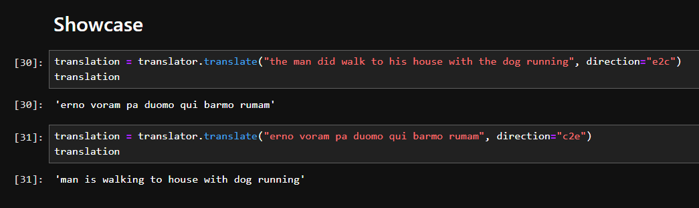
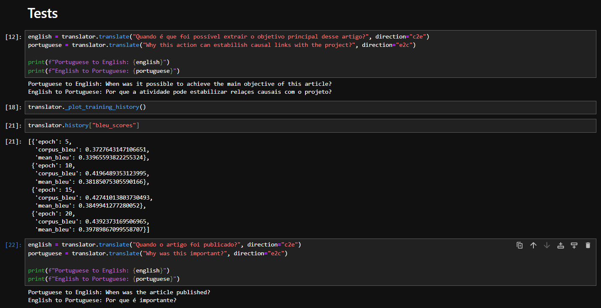

<div align="center">
    <h1>CoAL-1</h1>
    
    <p>Conlang Auto Learner</p>
    <div style="display: flex; justify-content: center; gap: .5rem;">
        
        
        
    </div>
</div>

---

A neural machine translation system that automatically learns and translates constructed languages (conlangs) based on a small set of translation examples. This project uses transfer learning with pre-trained language models to achieve high-quality translations with minimal training data.



In the example above, **CoAL** learned a language with only 45 examples via transfer learning and augmentation techniques. The model has also shown positive results for big datasets, as can be seen below on a training task for Portuguese to English questions translation (*special thanks to [Paulo Pirozelli's Pirá: A Bilingual Portuguese-English Dataset for Question-Answering about the Ocean, the Brazilian coast, and climate change](https://huggingface.co/datasets/paulopirozelli/pira)*)



## Features

- **Automatic Language Learning**: Learns conlang structure, vocabulary, and grammar from translation pairs
- **Bidirectional Translation**: Translates from conlang to English and English to conlang
- **Few-Shot Learning**: Requires only a small dataset of translation examples
- **Parameter-Efficient Fine-Tuning**: Uses LoRA to fine-tune only a small subset of model parameters
- **Data Augmentation**: Automatically expands limited training data
- **Interactive Mode**: Command-line interface for real-time translations
- **Batch Processing**: Support for translating multiple texts or files


## Development

**CoAL** was tested on a diverse range of hardware, which has helped a lot on understanding the capabilities of the system and its problems. Luckily, there were more good surprises than problems, but improvement is never a waste of time, so it will be key to keep improving **CoAL**'s architecture.

The hardware in which it was tested was:

- **NVIDIA T4**: Used during early development, specially on the architecture without learning transfer. Yielded some good insights on performance and capability;
- **TPU v2**: Also used during early development, but was the first to be used on the learning transfer architecture. Was key to understand the final shape of the system's architecture;
- **NVIDIA A40**: Yielded awesome insights on later development, as it was used to test T5-Small and T5-Base, the first base models to grant SoTA performance;
- **NVIDIA A100**: The most powerful and important hardware used in development, could handle many tests and really yielded key insights to understand data structure and how the model was using it to leverage performance.

## Installation

### Start locally

```
# Clone the repository
git clone https://github.com/matjsz/coal.git
cd coal

# Create a virtual environment
python -m venv venv
source venv/bin/activate  # On Windows: venv\Scripts\activate

# Install dependencies
pip install torch transformers peft tqdm matplotlib sentencepiece
```

## Quick Start

### Training a New Translator

#### Important note about T5-Large

If choosing to use **T5-Large** as the base for **CoAL**, it is known that it's not possible to use **FP16** due to a problem with **T5ForConditionalGeneration** (You can [check this issue](https://github.com/huggingface/transformers/issues/10830) to learn more about it), so it's **required** to disable **FP16** on **CoALT5Translator** in order to train it, otherwise it will have **NaN** loss on `train_loss` and a constant `val_loss`.

```python
from coal_t5 import CoALT5Translator, extract_dataset

# Example conlang data
# .txt, .csv
data = extract_dataset("my_data.txt")
# Create and train translator
translator = CoALT5Translator(
    model_name="t5-small",
    use_peft=True,
    batch_size=4,
    num_epochs=20,
    output_dir="coal_t5_translator"
)

# Train the model
translator.train(
    data_string=data,
    test_size=0.2,
    augment=True
)
```

### Important information regarding training

After training your conlang, you will notice that it has a validation loss value (`val_loss`), if you don't know how to interpret it, the table below explains what it could mean, it may vary, but it's mostly something close to the values on the table:

| Loss Range | Interpretation | Translation Quality
|-----|-----|-----
| > 3.0 | Poor convergence | Mostly incorrect translations
| 2.0 - 3.0 | Basic learning | Captures some words but grammatically incorrect
| 1.0 - 2.0 | Good learning | Understandable translations with some errors
| 0.5 - 1.0 | Very good | Mostly correct translations
| < 0.5 | Excellent | Near-perfect translations

If you constantly train the conlang and the values doesn't improve or the `val_loss` remain stuck on a single value, it usually means that your conlang dataset needs more data and **CoAL-1** isn't able to learn any further (it has a limit too!).

#### Tips

**Target validation loss**: Aim for **0.8-1.5** with a small dataset (30-100 examples). It may be easier for languages with a more clear structure, but languages like Na'vi are usually harder for **CoAL-1** to learn.

**Early stopping patience**: Set to 5-10 epochs, as loss may plateau before improving again

**Overfitting signals**:
- Training loss much lower than validation loss (gap > 0.5)
- Validation loss decreasing then increasing

**Underfitting signals**:
- Both losses remain high (> 2.0)
- Losses decrease very slowly

If **overfit**: The model may be learning well, but has few data. This indicates that the language is easy to learn.

If **underfit**: The model may be struggling to learn, more data is needed. This indicates that the language is hard to learn.

#### BLEU Score

The BLEU score is a number between zero and one that measures the similarity of the machine-translated text to a set of high quality reference translations. This score is applied to your conlang automatically during training if enabled by `eval_bleu` at `CoalT5Translator`. It usually means:

| BLEU Score | Interpretation | Translation Quality |
|-----|-----|-----
| < 0.1 | Poor | Translations are mostly incorrect or nonsensical. |
| < 0.2 | Fair | Some words are translated correctly, but grammar is incorrect. |
| < 0.3 | Moderate | Translations are understandable but contain significant errors. |
| < 0.4 | Good | Translations are mostly correct with some minor errors. |
| < 0.5 | Very Good | Translations are fluent and accurate with few errors. |
| > 0.5 | Excellent | Translations are nearly perfect. |

You can also do the following:

```python
from coal_t5 import interpret_bleu_score

interpret_bleu_score(0.6961, 100)
```

```
{'score': 0.6961,
 'quality': 'Excellent',
 'description': 'Translations are nearly perfect.',
 'context': 'For a medium dataset of 100 examples, this is Excellent.'}
```

### Testing The Translator

```python
english = translator.translate("thou drinkth waterth", direction="c2e")
conlang = translator.translate("you drink water", direction="e2c")

print(f"English: {english}")
print(f"Conlang: {conlang}")
```

### Using a Trained Translator

```python
from coal import CoALT5Translator

# Load a trained model
translator = CoALT5Translator.load("coal_t5_translator/final_model")

# Translate from conlang to English
english = translator.translate("thou eath thy appleth", direction="c2e")
print(f"English: {english}")

# Translate from English to conlang
conlang = translator.translate("I see you", direction="e2c")
print(f"Conlang: {conlang}")
```

### Interactive Mode

```shellscript
python coal_app.py --model coal_t5_translator/final_model --mode interactive
```

## Data Format

The translator accepts conlang data in the following format:

```plaintext
conlang_text|english_translation
```

Each line contains a pair of conlang text and its English translation, separated by a pipe character (`|`).

## Technical Details

### Architecture

**CoAL-1** uses the **T5** (Text-to-Text Transfer Transformer) model as the foundation for the translation system. T5 is an encoder-decoder model specifically designed for sequence-to-sequence tasks like translation.

Key components:

- **Base Model**: T5-small (60M parameters) by default, but can be configured to use larger variants
- **Fine-Tuning**: Parameter-Efficient Fine-Tuning (PEFT) with LoRA (Low-Rank Adaptation)
- **Tokenization**: Uses T5's subword tokenizer
- **Training**: Bidirectional training (conlang→English and English→conlang)
- **Generation**: Beam search with configurable parameters


### Why T5 over Causal Language Models?

For conlang translation, T5's encoder-decoder architecture offers several advantages:

1. **Bidirectional Context**: The encoder processes the entire source sentence bidirectionally
2. **Parameter Efficiency**: More efficient for translation tasks than causal LMs
3. **Training Stability**: More stable during fine-tuning for translation tasks
4. **Resource Requirements**: Requires less computational resources

### Data Augmentation

To maximize learning from limited examples, the system employs several data augmentation techniques:

1. **Case Variations**: Adding capitalized versions of examples
2. **Word Order Variations**: Adding reversed word order for multi-word phrases
3. **Vocabulary Recombination**: Creating new combinations from existing vocabulary mappings

## Training Process

The training process involves:

1. **Data Parsing**: Converting the input format into training pairs
2. **Data Augmentation**: Expanding the training data
3. **Tokenization**: Converting text to token IDs
4. **Model Initialization**: Loading the pre-trained T5 model
5. **PEFT Setup**: Configuring LoRA for parameter-efficient fine-tuning
6. **Training Loop**: Fine-tuning with early stopping based on validation loss
7. **Model Saving**: Saving checkpoints and the final model

### Training Parameters

Key parameters that can be configured:

- `model_name`: Base pre-trained model (default: "t5-small")
- `use_peft`: Whether to use parameter-efficient fine-tuning (default: True)
- `peft_r`: LoRA rank (default: 8)
- `batch_size`: Batch size for training (default: 8)
- `lr`: Learning rate (default: 5e-4)
- `num_epochs`: Maximum number of training epochs (default: 20)
- `max_length`: Maximum sequence length (default: 128)

## Advanced Usage

### Batch Translation

```python
texts = ["thou eath", "thou walkth toth", "Ith eath thy appleth"]
directions = ["c2e", "c2e", "c2e"]

app = ConlangTranslatorApp("coal_t5_translator/final_model")
results = app.batch_translate(texts, directions)

for result in results:
    print(f"Source: {result['source']}")
    print(f"Translation: {result['translation']}")
```

### File Translation

```shellscript
python coal_app.py --model coal_t5_translator/final_model --mode file --input input.txt --output output.txt --direction c2e
```

## Performance Considerations

- **GPU Acceleration**: Training and inference are significantly faster with a GPU
- **Model Size**: Larger T5 models (t5-base, t5-large) may provide better results but require more resources
- **Training Data**: More diverse examples generally lead to better generalization
- **Hyperparameters**: Adjust batch size, learning rate, and LoRA parameters based on your dataset size

## License

This project is licensed under the MIT License - see the LICENSE file for details.

## Citation

If you use this project in your research or work, please cite:

```plaintext
@software{coal,
  author = {Matheus J.G. Silva},
  title = {CoAL-1: Neural Machine Translation for Constructed Languages},
  year = {2025},
  url = {https://github.com/matjsz/coal}
}
```

## Acknowledgments

- This project uses Hugging Face's Transformers library
- The PEFT implementation is based on the PEFT library
- Special thanks to the T5 and LoRA authors for their research